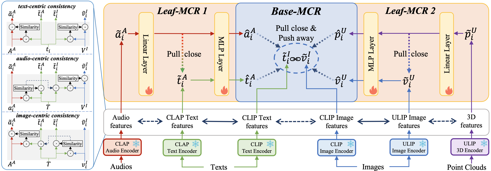

# Ex-MCR: Extending Multi-modal Contrastive Representation

Zehan Wang*, Ziang Zhang*, Luping Liu, Yang Zhao, Haifeng Huang, Tao Jin, Zhou Zhao*

PyTorch implementation and pretrained models for Ex-MCR.

Ex-MCR is a training-efficient and paired-data-free method to flexibly learn unified contrastive representation space, by integrating the knowledge of existing MCR spaces. Specifically, it aligns multiple existing MCRs into the same based MCR. 

This implementation align the MCR spaces of CLAP (audio-text) and ULIP (3D-vision) into the CLIP (vision-text). Without using any paired data, it learns a 3D-image-text-audio unified contrastive representation, and achieves state-of-the-art performance on cross-modal tasks between Leaf-MCR and Base-MCR. The results further demonstrate the emergent semantic alignment between the extended modalities (e.g., audio and 3D), which highlights the great potential of modality extensibility in various downstream tasks.



## News

- C-MCR has been accepted by NIPS 2023!🔥🔥🔥 [[paper](https://arxiv.org/abs/2305.14381)] [[code](https://github.com/MCR-PEFT/C-MCR)]


## File structure:
```
-assets
	[demo samples, including image, audio and 3d model]
-checkpoints
	[weight of clip,clap,ulip and ex-mcr_clap, ex-mcr_ulip]
-exmcr
	- ULIP [source code of ULIP]
	exmcr_projector.py [the projector of ex-mcr]
	exmcr_trunks.py [feature extractor of clip, clap and ulip]
	exmcr_model.py [combine projector and trunks together with useful functions]
	type.py
		
```

## Usage
### Install enviornments
Install pytorch 1.13+ and other 3rd party dependencies.
```shell
conda create -n exmcr python=3.8.16
conda activate exmcr
pip install -r requirements.txt
```
For inferencing, you need to put pretrained weights in the `checkpoints` diretory, as below:
```
-checkpoints
	ex_clap.pt
	ex_ulip.pt
	laion_clap_fullset_fusion.pt
	pointbert_ULIP-2.pt
```
All feature extractors we use and their pretrained weights are shown below, you may need to download some of them:

- **CLIP**：vit/B-32, you can find the repository [here](https://huggingface.co/openai/clip-vit-base-patch32)
- **CLAP**：LAION_AI/CLAP 630k-fusion-best.pt, you can find the repository [here](https://github.com/LAION-AI/CLAP) and you can download the weight we use [here](https://huggingface.co/lukewys/laion_clap/blob/main/630k-fusion-best.pt).
- **ULIP**：pointbert v2, you can find the repository [here](https://github.com/salesforce/ULIP) and you can download the weight we use [here](https://storage.cloud.google.com/sfr-ulip-code-release-research/pretrained_models/ckpt_zero-sho_classification/pointbert_ULIP-2.pt)


The weights for projectors are already in `checkpoints`, the following links are used as a backup:

- **Ex-CLAP**: [Google_Drive](https://drive.google.com/file/d/19GNAZi_A7Zqb8ZfDkvo4yIpKinQ-1Sme/view?usp=sharing)
- **Ex-ULIP**: [Google_Drive](https://drive.google.com/file/d/16QtRCn3U-kfU_xtE0mdYp0fFznJc59F3/view?usp=sharing)


Extract and compare embeddings in Base-MCR across modalities:
```python
from exmcr.exmcr_model import Ex_MCR
from exmcr.exmcr_model import ModalityType, MCRType
import torch

input = {ModalityType.VISION: ['assets/toilet.jpeg',
                               'assets/dog.jpeg',
                               'assets/helicopter.jpeg'],
         ModalityType.TEXT: ['Someone is using the toilet.',
                             'The dog snarled at us.',
                             'The helicopter is circling overhead.'],
         ModalityType.AUDIO:['assets/toilet.wav',
                             'assets/dog.wav',
                             'assets/helicopter.wav'],
         ModalityType.PC:['assets/toilet.npy',
                          'assets/dog.npy',
                          'assets/helicopter.npy']
         }

device = 'cuda:0' if torch.cuda.is_available() else 'cpu'
model = Ex_MCR(device=device)

# you can get single modality embeddings by using these functions

# v_emb = model.get_vision_embedding(input)
# t_emb = model.get_text_embedding(input)
# a_emb = model.get_audio_embedding(input)
# p_emb = model.get_3d_embedding(input)

output = model.get_embeddings_in_base_mcr(input)

v_emb = output[ModalityType.VISION]
t_emb = output[ModalityType.TEXT]
a_emb = output[ModalityType.AUDIO]
p_emb = output[ModalityType.PC]

print('Audio-Vision Results')
sim = a_emb @ v_emb.T
logits = sim.argmax(dim=-1)
print(logits)

print('3D-Text Results')
sim = p_emb @ t_emb.T
logits = sim.argmax(dim=-1)
print(logits)

print('Audio-3D Results')
sim = a_emb @ p_emb.T
logits = sim.argmax(dim=-1)
print(logits)

print('over')

# Expected output:
# 
# Audio-Vision Results
# tensor([0, 1, 2])
# 3D-Text Results
# tensor([0, 1, 2])
# Audio-3D Results
# tensor([0, 1, 2])
# over
```

## TODO

- [x] Install environments
- [ ] News
- [ ] brief introduction for Ex-MCR
- [x] Usage
- [x] Citation
- [ ] Code for training the model
- [x] Code for inferencing the model


## Citing Ex-MCR
If you find this proiect useful in our research, please consider giving a star :star: and citation:
```
@misc{wang2023connecting,
      title={Connecting Multi-modal Contrastive Representations}, 
      author={Zehan Wang and Yang Zhao and Xize Cheng and Haifeng Huang and Jiageng Liu and Li Tang and Linjun Li and Yongqi Wang and Aoxiong Yin and Ziang Zhang and Zhou Zhao},
      year={2023},
      eprint={2305.14381},
      archivePrefix={arXiv},
      primaryClass={cs.LG}
}
```

lf you have any questions or suggestions, feel free to drop us an email ( wangzehan01@zju.edu.cn, ziangzhang@zju.edu.cn ) or open an issue.

### Acknowledgement 
Thanks to the open source of the following projects:
[CLIP](https://huggingface.co/openai/clip-vit-base-patch32), [CLAP](https://github.com/LAION-AI/CLAP), [ULIP](https://github.com/salesforce/ULIP), [Imagebind](https://github.com/facebookresearch/ImageBind).